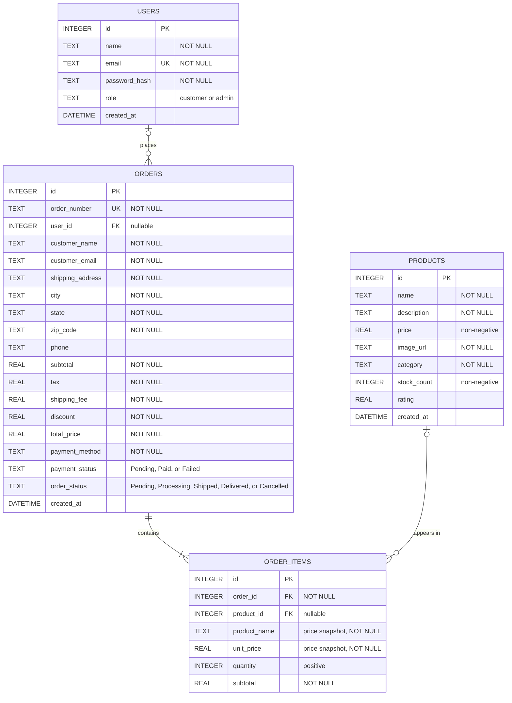

# EncoderX Store Entity Relationship Diagram

This ERD documents the implemented SQLite database for the EncoderX Store e-commerce platform.

## Relationship Semantics

| Relationship | Meaning | Delete behavior |
| --- | --- | --- |
| `users` to `orders` | A user may place many orders. An order may be guest checkout or linked to one user. | Deleting a user sets `orders.user_id` to `NULL`. |
| `orders` to `order_items` | Every order contains one or more persisted line items. | Deleting an order cascades and deletes its line items. |
| `products` to `order_items` | A product may appear in many order lines. A line may lose its product reference if the catalog item is deleted. | Deleting a product sets `order_items.product_id` to `NULL`. |

## Important Modeling Decisions

- `order_items.product_name`, `unit_price`, and `subtotal` are historical snapshots. They preserve the receipt even if a product is renamed, repriced, or removed from the catalog.
- `orders.user_id` is nullable because checkout supports guests through optional authentication.
- The shopping cart is intentionally not a database table. It is preserved in browser `localStorage` and submitted as checkout input; only completed orders and their line items are persisted.
- Inventory is stored on `products.stock_count` and reduced inside the same database transaction that creates the order and order items.
- `users.role` provides the database-level role value used by the application RBAC middleware (`customer` or `admin`).

## Indexes

The schema currently defines these supporting indexes:

- `idx_products_category` on `products(category)` for catalog filtering.
- `idx_orders_user_id` on `orders(user_id)` for customer order history.
- `idx_order_items_order_id` on `order_items(order_id)` for loading order line items.

## Source of Truth

The diagram is based on [schema.sql](../server/db/schema.sql), with workflow semantics cross-checked against the checkout and admin route implementations.
